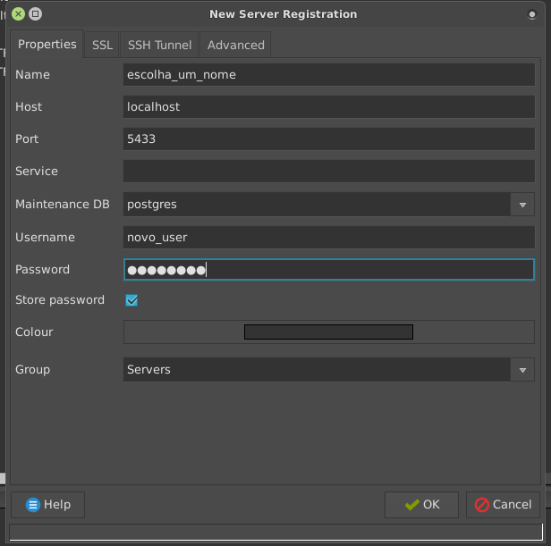
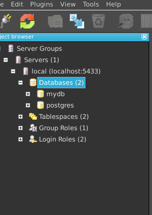

### Trabalho prático - Modelo Lógico (DDL)
#### Implementação do Modelo
Crie um banco que implemente seu modelo ER para a rede social (utilizando CREATE TABLE, INSERT e demais comendos DDL). Utilize o PostgreSQL do RLE ou crie seu próprio banco local com o H2 (instruções no Moodle).

Suas tabelas devem representar todas as entidades e relacionamentos do modelo. Inclua todos os atributos e crie chaves primárias e estrangeiras conforme seu modelo.

Insira também registros de teste em todas as tabelas (mínimo 3 para cada tabela e 6 para tabelas de relacionamentos N:N).

Caso você perceba que precisa mudar seu modelo ER, refaça o diagrama e atualize o repositório git.

#### Submissão

A submissão será corrigida no GitLab. Implemente sua solução e faça o commit/push para o repositório do grupo que foi informado para o Professor. Certifique-se de que o arquivo README.md esteja atualizado com os nomes, RAs e logins GitLab dos integrantes do grupo. Implemente sua solução no diretório "03b - Modelo Lógico - DDL” que foi criado automaticamente no seu repositório após a clonagem do repositório do professor. Seus esquemas devem estar descritos em um único arquivo texto com a extensão .sql. Submeta abaixo um texto com o link para o repositório do grupo e o resultado do comando "git log HEAD origin/master”. Submissões que não atendem às especificações não serão consideradas.

### Working
#### Postgres
É comum quando estamos estudando banco de dados e SQL enfrentarmos problemas para instalar e configurar em nossa máquina local um db-server rápido e fácil de configurar. Um tutorial que fiz para um amigo e que pode ser útil para você está a seguir foi testado em Ubuntu 14.04.

Primeiro, precisamos instalar o Postgres (ou PostgreSQL) no computador:

```sh
sudo apt-get update
sudo apt-get install postgresql
```

Assim que instalado, o Postgres database server deverá iniciar automaticamente. Devemos então criar um novo usuário para nosso acesso.

```
sudo -u postgres createuser -s novo_user
```

Devemos agora definir você como super usuário, para que possa criar tabelas normalmente e também definir uma senha para nosso usuário, para isso, digite no terminal:

```
sudo -u postgres psql
```
e depois que entrar no console psql, digite:
```
ALTER USER novo_user SUPERUSER CREATEDB;
ALTER ROLE
```
para a senha, digite:
```
ALTER USER novo_user WITH PASSWORD 'sua_senha';
```
para ver se deu tudo certo, dentro do terminal psql use:
```
postgres=# \du
                                   List of roles
 Role name |                         Attributes                         | Member of
-----------+------------------------------------------------------------+---
 novo_user  | Superuser, Create role, Create DB                          | {}
 postgres  | Superuser, Create role, Create DB, Replication, Bypass RLS | {}
```

Pronto, agora já podemos partir para um SGDB com GUI, como o pgAdmin.

#### pgAdmin

Instalar o pgAdmin também é simples, usemos:

```
sudo apt-get install pgadmin3
```

Depois da instalação, abrimos o pgAdmin III com
```
pgadmin3
```
e pronto, podemos começar a trabalhar.

Para se conectar ao databse server que acabamos de criar, vá em File -> Add Server e uma janela como a seguinte aparecerá:



Onde você pode colocar um nome, no host escreva `localhost` e nas portas use `5433` (se der erro, depois tente `5432`). Coloque também o nome do usuário que você definou, no nosso caso `novo_user` e sua senha.



Agora você pode trabalhar e usar/testar seus códigos SQL.

Bons estudos!
